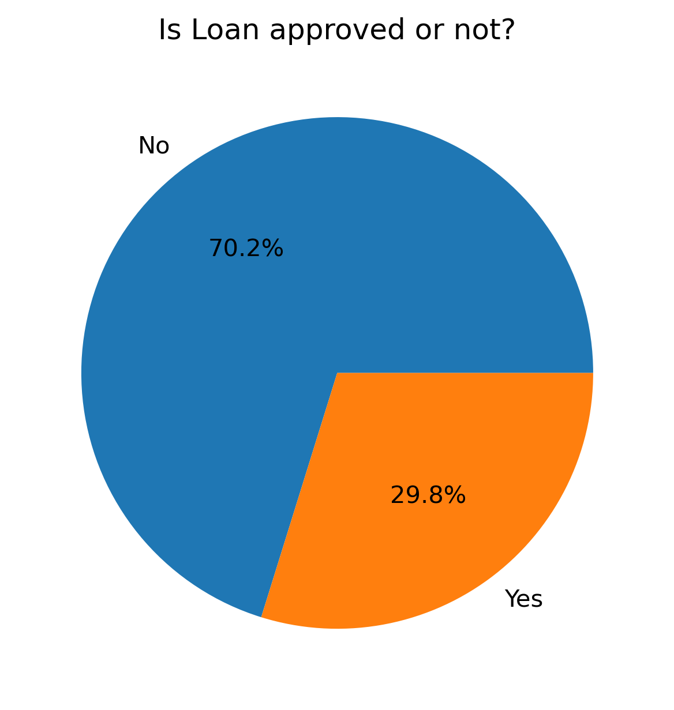
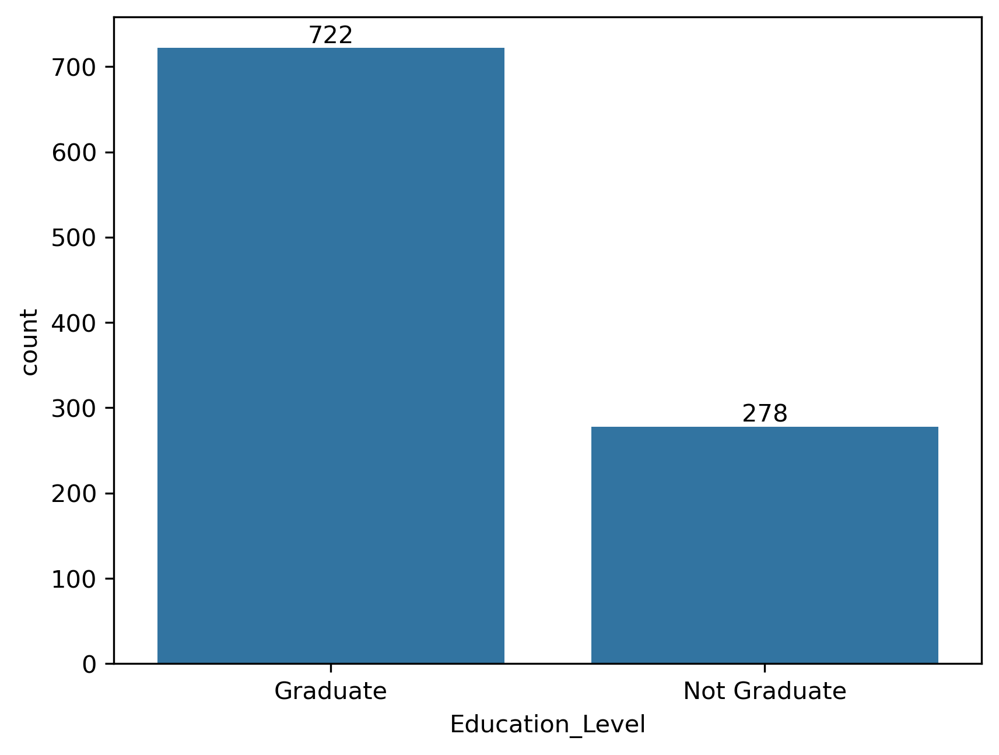
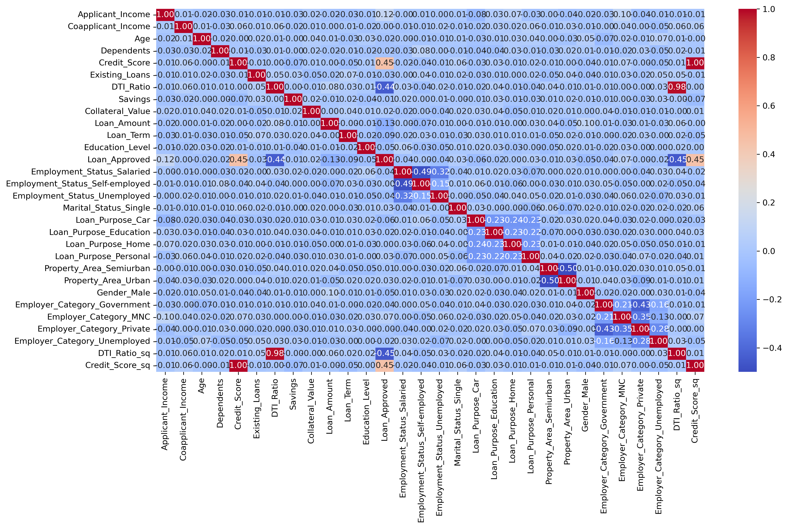
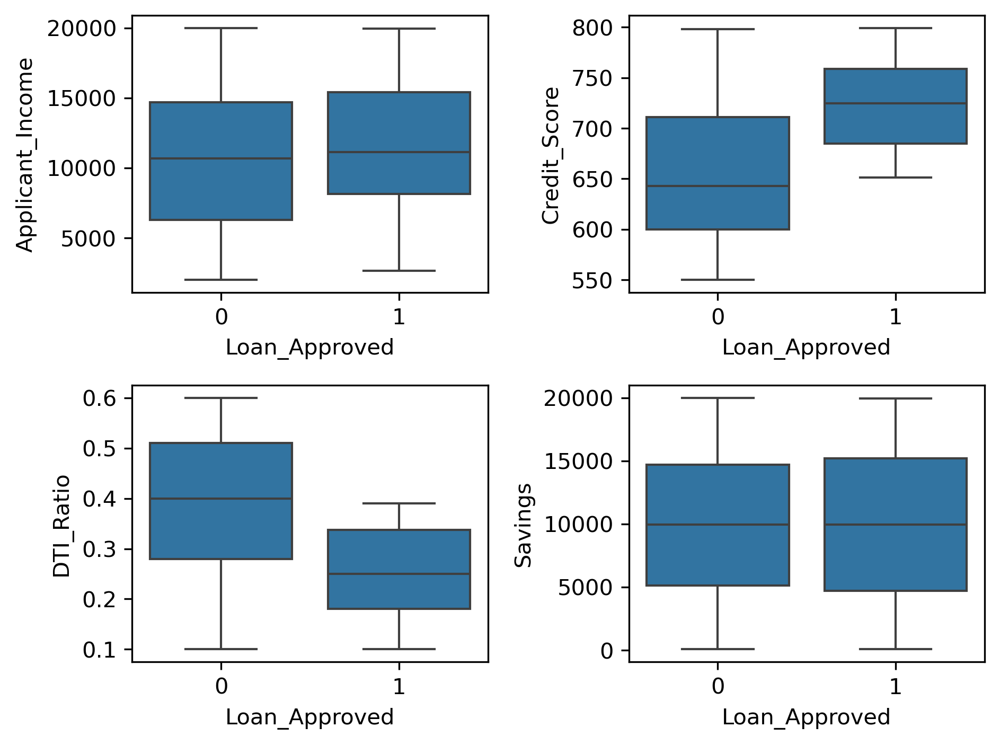
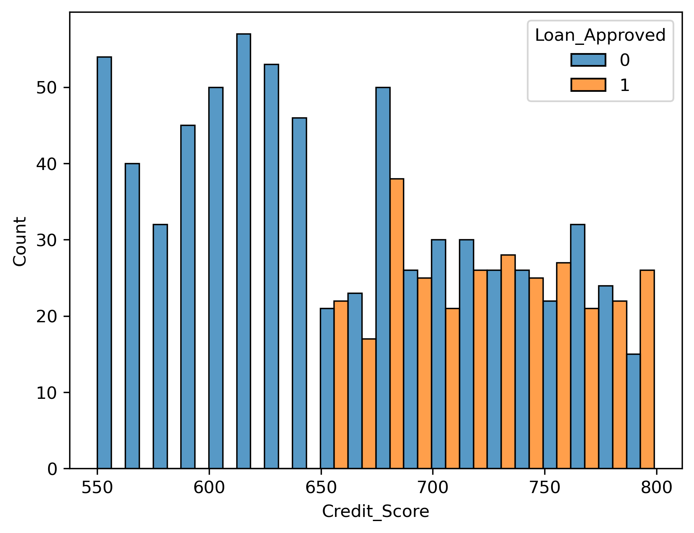

# CreditFlow: Loan Eligibility Assessment System
# Problem Statement

A mid-sized financial company named SecureTrust Bank offers personal and home loans to customers across urban and rural regions of India. Every day, hundreds of customers apply for loans through online and branch applications.

Until now, SecureTrust Bank has been using a manual verification process where loan officers evaluate applications by checking income proofs, employment details, credit history, and other documents. This process is time-consuming, biased, and inconsistent.

As a result, the bank faces two major challenges:

1. Good customers sometimes get rejected, leading to loss of business.
2. High-risk customers sometimes get approved, leading to financial losses.

To solve this problem, the bank wants to introduce an intelligent loan approval system powered by Machine Learning that can automatically analyse applicant details and predict whether a loan should be Approved or Rejected before final human verification.
___

# Objectives
The objective of this project is to automate the loan approval process based on customer details provided during the loan application process.
The system analyses applicant financial, personal, and credit-related information and predicts whether a loan application should be approved or rejected.

The goal is to:
- Automate loan approval decisions
- Reduce financial risk
- Improve decision consistency
- Minimize manual verification effort
- Enable data-driven lending decisions
___

# Tech Stack

| Category | Tools |
|-----------|--------|
| Programming | Python |
| Data Analysis | Pandas, NumPy |
| Visualization | Matplotlib, Seaborn |
| Machine Learning | Scikit-Learn |
| Development | Jupyter Notebook |

---


# Data Dictionary

| Variable           | Description                             |
| ------------------ | --------------------------------------- |
| Applicant_ID       | Unique applicant ID                     |
| Applicant_Income   | Monthly income of applicant             |
| Coapplicant_Income | Monthly income of co-applicant          |
| Employment_Status  | Salaried / Self-Employed / Business     |
| Age                | Applicant age                           |
| Marital_Status     | Married / Single                        |
| Dependents         | Number of dependents                    |
| Credit_Score       | Credit bureau score                     |
| Existing_Loans     | Number of already running loans         |
| DTI_Ratio          | Debt-to-Income ratio                    |
| Savings            | Savings balance                         |
| Collateral_Value   | Value of collateral provided            |
| Loan_Amount        | Loan amount requested                   |
| Loan_Term          | Loan duration (months)                  |
| Loan_Purpose       | Home / Education / Personal / Business  |
| Property_Area      | Urban / Semi-Urban / Rural              |
| Education_Level    | Graduate / Postgraduate / Undergraduate |
| Gender             | Male / Female                           |
| Employer_Category  | Govt / Private / Self                   |
| Loan_Approved      | Target Variable                         |

## Target Variable

```text
Loan_Approved
1 → Approved
0 → Rejected
```

---
# Data Cleaning

* Checked missing values
* Removed inconsistencies
* Verified data types
* Prepared data for machine learning models

---

## Exploratory Data Analysis (EDA)

### 1. Loan Approval Distribution

This plot shows the distribution of approved and rejected loan applications.



---

### 2. Education Level Distribution

This visualization shows the number of Graduate and Non-Graduate applicants in the dataset.



---

### 3. Correlation Heatmap

The heatmap illustrates the correlation between numerical features used for loan approval prediction.



---

### 4. Feature Analysis

Boxplots comparing Applicant Income, Credit Score, Debt-to-Income Ratio (DTI), and Savings against loan approval status.



---

### 5. Credit Score vs Loan Approval

This histogram highlights the relationship between applicant credit scores and loan approval outcomes.


___

# Feature Transformation

### Label Encoding

Applied on:

* Education_Level
* Loan_Approved

### One Hot Encoding

Applied on:

* Employment_Status
* Marital_Status
* Loan_Purpose
* Property_Area
* Gender
* Employer_Category

### Feature Scaling

Used StandardScaler for normalization of numerical features.

---

# Machine Learning Models

The following machine learning models were trained and evaluated:

### Logistic Regression

### K-Nearest Neighbors (KNN)

### Gaussian Naive Bayes

---

# Model Evaluation

Models were evaluated using:

* Accuracy
* Precision
* Recall
* F1 Score
* Confusion Matrix
___  

# Final Model

### Naive Bayes

The Gaussian Naive Bayes model was selected as the final model based on its performance on the processed dataset.

---

# Project Workflow

```text
Dataset
   ↓
Data Cleaning
   ↓
Encoding
   ↓
Feature Engineering
   ↓
Scaling
   ↓
Train-Test Split
   ↓
Model Training
   ↓
Model Evaluation
   ↓
Loan Approval Prediction
```

---

# Future Improvements

- Hyperparameter Tuning
- Cross Validation
- Feature Selection
- Model Deployment using Flask/FastAPI
- Real-Time Prediction API
- Interactive Dashboard

---

# 📁 Project Structure

```text
CreditFlow-Loan-Eligibility-Assessment-System/
│
├── creditwise_loan_system.ipynb
├── dataset.csv
├── README.md
│
├── images/
│   ├── loan_approval_distribution.png
│   ├── correlation_heatmap.png
│   ├── credit_score_vs_approval.png
│   ├── education_level_distribution.png
│   └── feature_analysis.png
│
└── requirements.txt
```

---

## Author

**Akash Dukare**

### Connect With Me

- LinkedIn: [www.linkedin.com/in/akashdukare](https://www.linkedin.com/in/akash-dukare-812bb822b)
---


